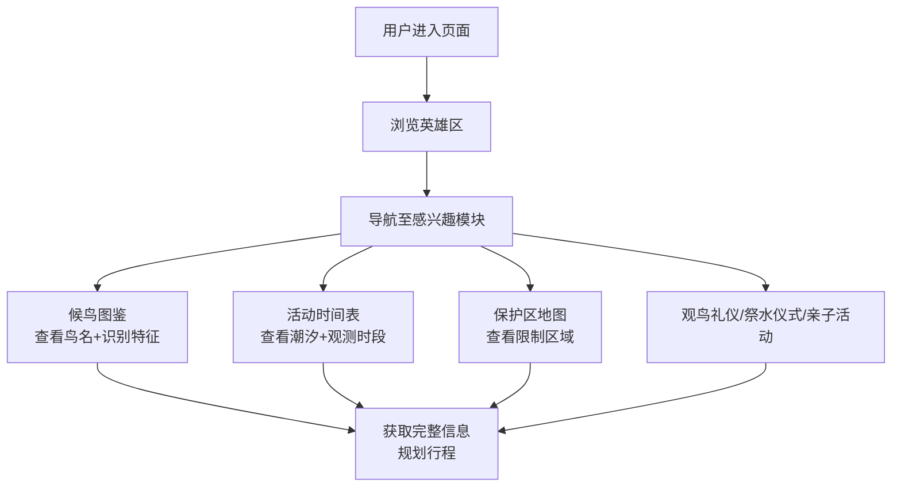

## 1. 产品概述

湿地鸟类民俗节专题页，旨在展示湿地生态文化与民俗传统的融合，为游客提供完整的活动指南和观鸟信息。

- 主要目的：介绍候鸟迁徙知识、观鸟礼仪、当地祭水仪式和亲子活动，提供详细的活动时间表和保护区信息
- 目标用户：鸟类爱好者、家庭游客、生态旅游者、文化探索者
- 市场价值：促进湿地生态旅游，传播环保理念，传承民俗文化

## 2. 核心功能

### 2.1 功能模块
1. **首页英雄区**：活动主题视觉、活动简介、快速导航
2. **候鸟迁徙**：迁徙路线、候鸟种类图鉴、识别特征
3. **观鸟礼仪**：观鸟准则、装备建议、行为规范
4. **祭水仪式**：仪式历史渊源、流程介绍、文化意义
5. **亲子活动**：活动项目、参与方式、教育意义
6. **活动时间表**：每日活动安排、潮汐时刻标注、最佳观鸟时段
7. **保护区地图**：开放区域、限制区域、观鸟点标注

### 2.2 页面详情

| 页面名称 | 模块名称 | 功能描述 |
|-----------|-------------|---------------------|
| 专题首页 | 英雄区 | 大幅湿地鸟类背景图、活动主题标题、倒计时、导航菜单 |
| 专题首页 | 候鸟迁徙 | 迁徙路线图、候鸟卡片展示（图片+名称+识别特征） |
| 专题首页 | 观鸟礼仪 | 图标化展示观鸟准则、装备清单、注意事项 |
| 专题首页 | 祭水仪式 | 仪式介绍图文、历史渊源、现场照片展示 |
| 专题首页 | 亲子活动 | 活动卡片、适合年龄、参与方式、活动亮点 |
| 专题首页 | 活动时间表 | 时间轴布局、潮汐水位图标、最佳观测时段高亮 |
| 专题首页 | 保护区地图 | 区域分布图、限制区域警示、观鸟点标记 |
| 专题首页 | 页脚 | 交通信息、联系方式、温馨提示 |

## 3. 核心流程

用户进入页面 → 浏览英雄区了解活动 → 通过导航或滚动查看各模块 → 查看候鸟图鉴了解识别特征 → 查看活动时间表规划行程 → 了解保护区限制区域 → 获取完整活动信息

## 4. 用户界面设计

### 4.1 设计风格
- **主色调**：湿地绿 `#2D5A27`、湖泊蓝 `#1E3A5F`
- **辅助色**：日落橙 `#E87722`、芦苇黄 `#D4A84B`
- **中性色**：米白 `#F5F2EB`、深灰 `#2C3E50`
- **字体**：标题使用"Noto Serif SC"衬线字体体现文化感，正文使用"Noto Sans SC"无衬线字体保证可读性
- **视觉元素**：芦苇纹理背景、水波纹动效、鸟类剪影装饰
- **按钮风格**：圆角矩形，悬停时有轻微上浮和阴影效果

### 4.2 页面设计概述

| 页面名称 | 模块名称 | UI元素 |
|-----------|-------------|-------------|
| 专题首页 | 英雄区 | 全屏背景图、渐变遮罩、大标题、活动日期、导航锚点 |
| 专题首页 | 候鸟迁徙 | 卡片网格布局、图片圆角、鸟名标题、特征标签、悬停放大效果 |
| 专题首页 | 观鸟礼仪 | 图标+文字列表、绿色主题、卡片式布局、渐变边框 |
| 专题首页 | 祭水仪式 | 左右分栏图文、古朴配色、装饰性边框、时间轴展示仪式流程 |
| 专题首页 | 亲子活动 | 彩色卡片、图标装饰、适合年龄标签、趣味动效 |
| 专题首页 | 活动时间表 | 时间轴布局、潮汐图标、高亮色块、可展开详情 |
| 专题首页 | 保护区地图 | 示意图、颜色区分区域、警示图标、图例说明 |

### 4.3 响应式设计
- 桌面端（≥1024px）：多列网格布局，完整展示所有内容
- 平板端（768px-1023px）：自适应列数，保持内容可读性
- 移动端（<768px）：单列布局，简化导航，优化触摸交互

### 4.4 动效设计
- 页面加载：元素渐入动画，从上到下依次显现
- 滚动触发：内容区域进入视口时淡入上移
- 卡片悬停：轻微上浮、阴影加深、图片缩放
- 导航：滚动时导航栏背景渐变不透明
- 时间表：当前时间高亮显示，潮汐数据动态展示
