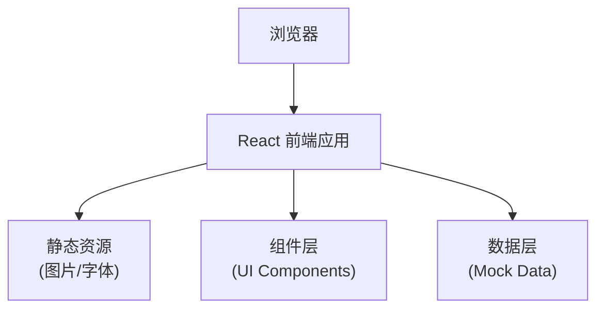

## 1. 架构设计



## 2. 技术描述

- **前端**：React@18 + TypeScript + Vite@5
- **样式**：TailwindCSS@3 + CSS Variables
- **图标**：lucide-react
- **状态管理**：zustand（按需使用）
- **初始化工具**：vite-init
- **后端**：无（纯前端静态页面）
- **数据**：Mock数据硬编码在组件中

## 3. 路由定义

| 路由 | 用途 |
|-------|---------|
| / | 湿地鸟类民俗节专题首页（单页应用，锚点导航） |

## 4. 项目结构

```
src/
├── components/
│   ├── HeroSection.tsx          # 英雄区
│   ├── BirdMigration.tsx        # 候鸟迁徙
│   ├── BirdCard.tsx             # 候鸟卡片
│   ├── BirdingEtiquette.tsx     # 观鸟礼仪
│   ├── WaterRitual.tsx          # 祭水仪式
│   ├── ParentChildActivities.tsx # 亲子活动
│   ├── Schedule.tsx             # 活动时间表
│   ├── ReserveMap.tsx           # 保护区地图
│   └── Footer.tsx               # 页脚
├── data/
│   └── mockData.ts              # Mock数据
├── types/
│   └── index.ts                 # 类型定义
├── App.tsx
├── main.tsx
└── index.css
```

## 5. 数据模型定义

### 5.1 候鸟信息类型
```typescript
interface Bird {
  id: string;
  name: string;
  scientificName: string;
  image: string;
  features: string[];
  habitat: string;
  bestTime: string;
}
```

### 5.2 活动时间表类型
```typescript
interface Activity {
  id: string;
  time: string;
  title: string;
  description: string;
  location: string;
  isBestViewing?: boolean;
  tideLevel?: 'high' | 'medium' | 'low';
  tideTime?: string;
}

interface DaySchedule {
  date: string;
  dayOfWeek: string;
  activities: Activity[];
}
```

### 5.3 保护区区域类型
```typescript
interface ReserveZone {
  id: string;
  name: string;
  type: 'open' | 'restricted' | 'prohibited';
  description: string;
  birdingPoints?: string[];
}
```

## 6. 核心组件说明

### 6.1 BirdCard 组件
- 展示候鸟图片、名称、学名
- 识别特征标签列表
- 悬停动效：图片缩放、卡片上浮
- 响应式布局：桌面端3列，平板端2列，移动端1列

### 6.2 Schedule 组件
- 时间轴布局展示每日活动
- 潮汐图标标识高低潮
- 最佳观测时段高亮显示
- 可折叠/展开查看详情

### 6.3 ReserveMap 组件
- 示意图展示保护区分区
- 颜色区分：绿色开放区、黄色限制区、红色禁入区
- 观鸟点标记
- 图例说明区域限制规定
